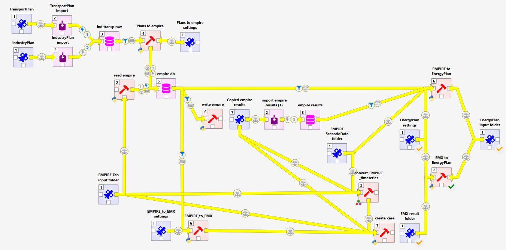
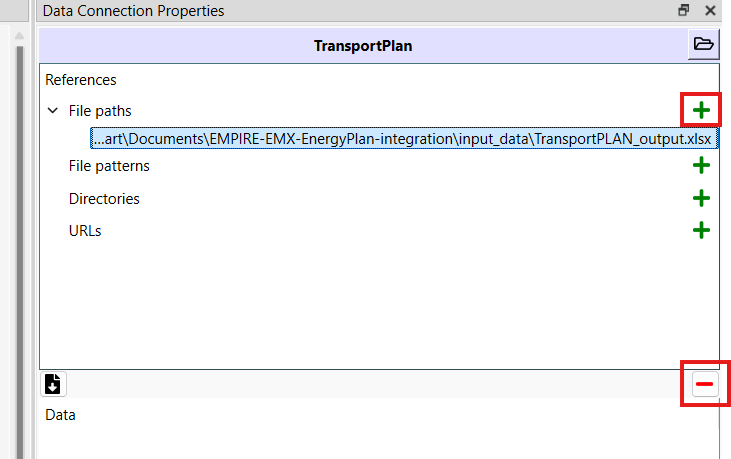
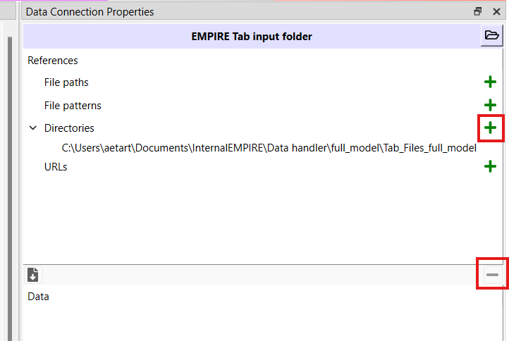
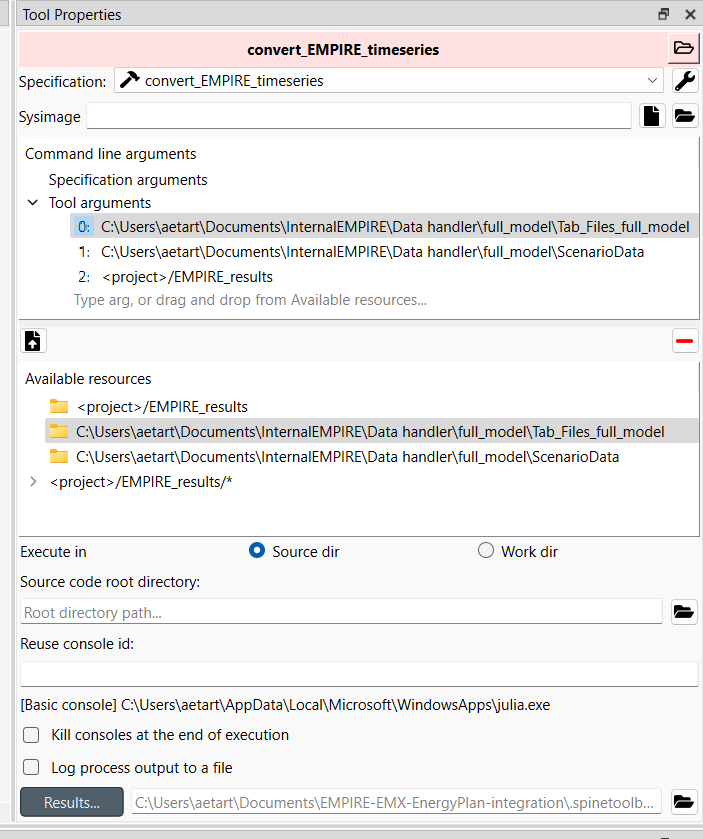

# EMPIRE-EMX-EnergyPlan-integration

Includes the integration of three energy system modelling tools EMPIRE, EMX (EnergyModelX) and EnergyPlan. 

Additionally input data for EMPIRE can be taken from TransportPlan and IndustryPlan results.

The goal of this workflow is to model the nordic region energy system future with hydrogen infrastructure. However, this could be expanded to other regions. 

EMPIRE is energy system stochastic investment model for the European scope. The results of these investments are passed to EMX and EnergyPlan. Additionaly, some of the EMPIRE inputs are used in the two others and therefore passed as well. 

EMX is used for regional modelling. It models the energy system of the Nordic countries in NUTS-3 level to provide the investments to Hydrogen infrastructure. The hydrogen infrastructure costs are passed to the EnergyPlan. 

EnergyPlan is used for country level operational modelling of the energy system.

TransportPlan and IndustryPlan can be used to update the energy demands in EMPIRE.

To use this workflow one needs:

- EMPIRE
- EMX (EnergyModelX)
- EnergyPlan
- Python
- Julia
- Spine Toolbox
- TransportPlan and IndustryPlan result files for the Europe
- Initial input file for EnergyPlan (not all values are transferred from other tools)
- Initial input files for EMX. Here we use .yml files as EMX input. Template files are provided with the repository, but you can use different ones. You need the following inputs:
    - global_data.yml
    - regions.yml
    - resources.yml
    - storyline_confing.yml
    - techs.yml
    - transmission_modes.yml



This work has been funded by Nordic Energy Research project NordicH2ubs.

# Installation

Install git.
Git clone this repository to a directory of your choosing:

```
git clone https://github.com/EMPIRE-EMX-EnergyPlan-integration/EMPIRE-EMX-EnergyPlan-integration
```

Install Spine-Toolbox 

Follow the instructions in https://github.com/spine-tools/Spine-Toolbox
You can install it with pipx, git or by getting zip-file.


The transformation uses INES-EMPIRE. Install it parallel to the folder of this directory to not break the relative paths:

```
git clone https://github.com/ines-tools/ines-empire
```

Additionally, you will need both Python and Julia.

# Set-up

1. First open the spine toolbox using the instructions given on its documentation.

2. File -> Open project -> Select this folder of this repository.

3. You will see several blue data connections with exclamation marks and some without them. This exclamation mark means that the file or folder does not exist. All of them show a path to be an example, but you should replace the paths to match the places of your files.

4.  If the TransportPlan and IndustryPlan are included as inputs to the EMPIRE, choose results files in the data connections `TransportPlan` and `IndustryPlan`. Click the data connection and remove the existing plan with the red minus button and add new with the green plus button.




5. Set the `EMPIRE Tab input folder` and `EMPIRE ScenarioData folder`. This is done the same way but using the directories option.



6. Exclamation marks should now have appered on `read empire`, `create_case` and `convert_EMPIRE_timeseries`. This is because the tool arguments do not exist. These are the folders that you included in the previous stage. 
To do add these folders, delete the non-existing path and drag the new folder path from the Available resources. Note that the order of the paths should stay the same.




# Run

1. First run `read empire` tool. Transforms the EMPIRE .tab input to the empire db. Select the tool and press "Execute: Selection".

2. Run `TransportPlan import` and `IndustryPlan import`.

3. Run `Plans to empire`
    
    Plans to empire data connection includes the year and scenarios that are transferred to the EMPIRE database. The data is interpolated if the year chosen are between the years in the input. Extrapolation is not possible.
    You can change the years in use and the scenarios from the 'Plans to empire settings'. Double click the file path in the data connection panel or find it from the repository folder. 

4. Run `write empire`

    This re-creates the tab files for the empire, but with the inclusion of the TransportPlan and IndustryPlan inputs

5. Run EMPIRE

    This workflow does not have a button for it as it requires more memory and computational power than you laptop has. Use computational cluster available to you.

6. Add the folder of the results to the `Copied empire results`. This time it needs to be added both to the directories and the file patterns. 

7. Next setup the EMX. Add the EMPIRE result folder path to the `convert_EMPIRE_timeseries` and `create_case`. It is done by draging the folder from the Available resources like in the set-up stage 6.

8. `EMPIRE_to_EMX_settings` include the following settings:
    
    - 'template_folder' and 'output_folder': you don't need to touch these, but if you want to use a different set of template files, you can change the path here, or just copy-paste the files
    - 'country_codes' chooses both which countries are transformed and what they are called in EMX
    - 'empire_to_EMX_tech_mapping' maps the technology names of EMPIRE and EMX, you should not need to touch it unless new things are added
    - 'additional resources' add resources missing from EMPIRE
    - 'techs_excluded_from_mapping' excludes some techs completely
    - 'techs_outside_empire_to_regions' addes new techs missing from EMPIRE
    - You can also choose which parts of EMPIRE are transferred to EMX, by default all possible are set true

9. Run `EMPIRE_to_EMX`, `convert_EMPIRE_timeseries` and `create_case`.

10. Run EMX. Again, your laptop probably can't do this. Use computational cluster available to you.

11. Add the EMX result folder to the `EMX result folder`

12. Run first `EMPIRE to EnergyPlan` and then `EMX to EnergyPlan`

    These create an EnergyPlan inputfile from an existing EnergyPlan input with modifications coming from EMPIRE and EMX inputs and results.

    EnergyPlan settings should be modified to match the case you are modelling.

    - Set 'Country_filename' to match the EnergyPlan inputfile for that country. Multiple countries and their files can be included to the map.

    - Set 'Years_modelled' list to set the years you want to model. 'Year_mapping' and 'Year_mapping_EMX' keys should match the years on that list. The values are the corresponding syntax for these years in EMPIRE and EMX. The inputfiles created are the combination of the countries and the years.

    - On EMX part of the settings:
        
        - You can set which EMX entities correspond to the categories of EnergyPlan. Sums and weighted averages are used to calculate the new values in EnergyPlan. 
        
        - Additionally, you can set which parts of the H2 infrastructure are transferred from EMX to EnergyPlan. By default all are set true.

    - On EMPIRE part of the settings you have more options to check:

        - 'Country_nodes' tells which of the nodes in EMPIRE are included in each country.
        
        - 'Node_key' handles the exceptions where the name in csv files does not match the name in tab files.

        - 'Timeseries year' tells which weather year is used. This does not need to match the year modelled. 

        - 'Exclude_connections_to_nodes' excludes these connections from the outside connection capacity calculations. Use for off-shore wind nodes.

        - Similarly to the EMX, here you can choose which EMPIRE production entities are used to calculate each EnergyPlan production values. These include both capacity and costs. Sums and capacity weighted averages are used.

        - 'Only_power_production' are the condensing plants with only power production

        - 'Share of Condensing_PP_to_PP2' describes the precentage of the condensing production is with only power

        - 'Share of condensing_PP1_in_CHP3' describes the precentage of the condensing production that is CHP3

        - You can also set which parts of the EMPIRE data is transfered to the EnergyPlan input. By default all are set true.


