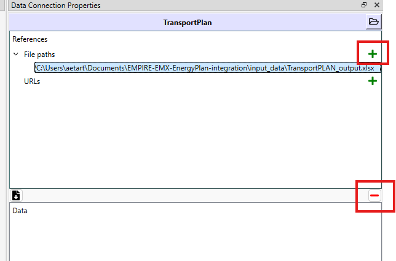

# EMPIRE-EMX-EnergyPlan-integration
Includes the integration of three energy system modelling tools EMPIRE, EMX and EnergyPlan. Additionally input data for EMPIRE can be taken from TransportPlan and IndustryPlan results.

Status:
Transormation to TransportPlan and IndustryPlan is complete. Otherwise, not working.

# Installation

## Install Spine Toolbox

Install git.
Git clone this repository to a directory of your choosing:

```
git clone https://github.com/EMPIRE-EMX-EnergyPlan-integration/EMPIRE-EMX-EnergyPlan-integration
```

Install Spine-Toolbox 

Follow the instructions in https://github.com/spine-tools/Spine-Toolbox
You can install it with pipx or git.


The transformation uses INES-EMPIRE and INES-tools. Install them parallel to the folder of this directory to not break the relative paths:

```
git clone https://github.com/ines-tools/ines-empire
```
```
git clone https://github.com/ines-tools/ines-tools
```

# Set-up

Set the folder paths to the EMPIRE input .tab files and the output path in the read empire and write empire tools by clicking them and modifying the tool arguments.


If the TransportPlan and IndustryPlan are included as inputs to the EMPIRE, choose results files in the data connections "TransportPlan" and "IndustryPlan". Click the data connection and remove the existing plan with the red minus button and adding new with the green plus button.



Plans to empire data connection includes the year and scenarios that are transferred to the EMPIRE database. The data is interpolated if the year chosen are between the years in the input. Extrapolation is not possible.

# Run

1. First run ´read empire´ tool. Transforms the EMPIRE .tab input to the empire db. Select the tool and press "Execute: Selection".
2. Run ´TransportPlan import´ and ´IndustryPlan import´.
3. Run ´Plans to empire´
4. Run ´write empire´

Now you will have empire input files, with the energy demand inputs from the TransportPlan and IndustryPlan included.


